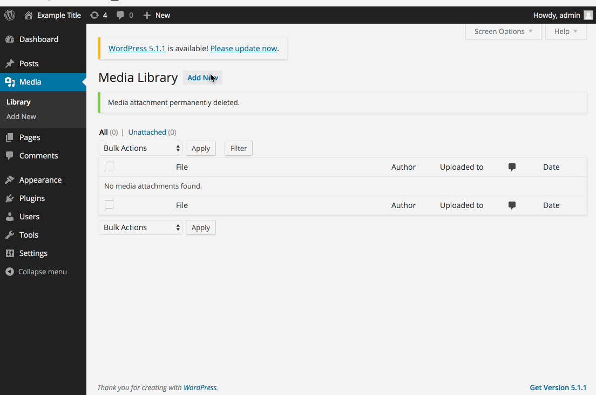
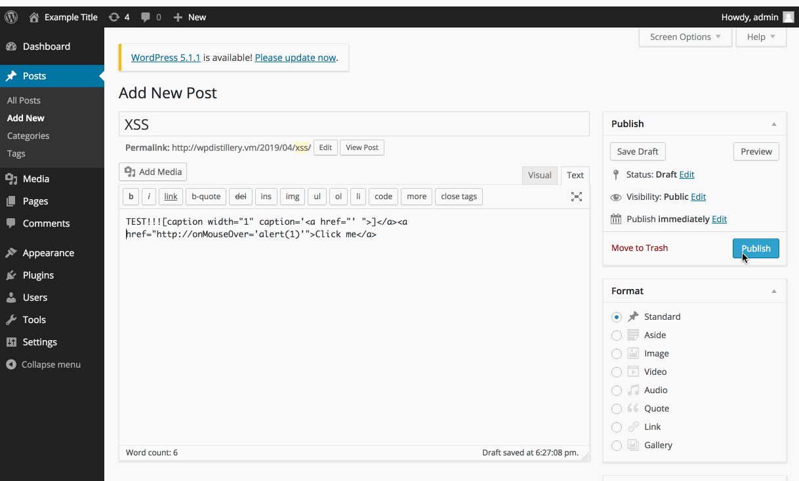
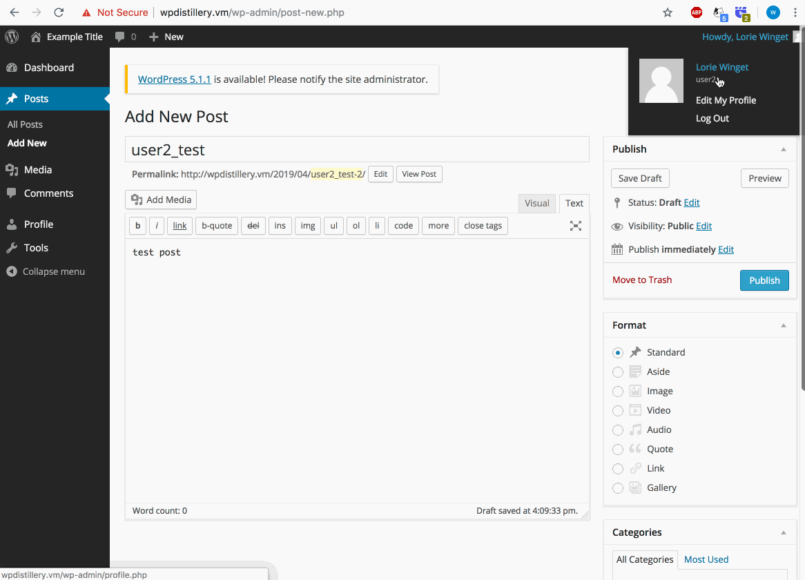

# Cybersecurity-WEEK7-8-Assignment - WordPress Pentesting

Time spent: **6** hours spent in total

> Objective: Find, analyze, recreate, and document **(at most) five vulnerabilities** affecting an old version of WordPress

## Pentesting Report

1. (Required) : XSS vulnerability in new post file with unsafe processing of file names
  - Summary: An attacker can create a specially crafted image file name which, when uploaded in WordPress,
             injectsmalicious JavaScript code into the application.
    - Vulnerability types: XSS
    - Tested in version: 3.9
    - Fixed in version: 4.6.1
  - GIF Walkthrough: 
  - Steps to recreate: 
    - download or choose a image file (png or jpg formate)
    - rename file name to exampleimage.jpg or example...>.png
    - go to Media and upload this file
    - once user viewing this image, user will be attacked
  - Reference:     https://sumofpwn.nl/advisory/2016/persistent_cross_site_scripting_vulnerability_in_wordpress_due_to_unsafe_processing_of_file_names.html
  - Affected source code: https://github.com/WordPress/WordPress/commit/c9e60dab176635d4bfaaf431c0ea891e4726d6e0
  
 --------------------------------------------------------------------------------------------------------------------------------------
 
 2. (Required) : XSS vulnerability: Authenticated Shortcode Tags
  - Summary: An attacker can create a specially HTML tags, as well as ‘shortcodes’, when post in WordPress,
             injectsmalicious JavaScript code into the application. Therfore readers will render the injected JavaScript.
    - Vulnerability types: XSS
    - Tested in version: 3.9
    - Fixed in version: 4.3.1
  - GIF Walkthrough: 
  - Steps to recreate: 
    - add new post
    - type content such as TEST!!![caption width="1" caption='<a href="' ">]</a><a href="http://onMouseOver='alert(1)'">Click me</a>
      (note: the make sure you click "Text" at right of content box)
      
    - publish the post
    - once user mouse move to link, that readers will render the injected JavaScript
  - Reference: 
        1) https://wpvulndb.com/vulnerabilities/8186
        2) https://wordpress.org/news/2015/09/wordpress-4-3-1/
        3) https://blog.checkpoint.com/2015/09/15/finding-vulnerabilities-in-core-wordpress-a-bug-hunters-trilogy-part-iii-ultimatum/
  - Affected source code: https://github.com/WordPress/WordPress/commit/f72b21af23da6b6d54208e5c1d65ececdaa109c8
  
  --------------------------------------------------------------------------------------------------------------------------------------
  
  3. (Required) : REST API allow access with no authentication
  - Summary: WordPress REST API allows anonymous access, this API will list the usernames of anyone who has published a post on a                    WordPress site so attacker can harvest all usernames.
    - Vulnerability types: User Enumeration
    - Tested in version: 3.9
    - Fixed in version: 4.7.1
  - GIF Walkthrough: 
  - Steps to recreate: 
    - Create an account and log in with that account.
    - Make a post with the Author.
    - Log out so that you are no longer authenticated
    - then visit wpdistillery.vm/wp-json/wp/v2/users to get all usernames from the site
  - Reference: https://www.wordfence.com/blog/2016/12/wordfence-blocks-username-harvesting-via-new-rest-api-wp-4-7/
               https://wordpress.org/news/2017/01/wordpress-4-7-1-security-and-maintenance-release/
  - Affected source code: https://core.trac.wordpress.org/attachment/ticket/39211/39211.diff

## Resources

  - [WordPress Source Browser](https://core.trac.wordpress.org/browser/)
  - [WordPress Developer Reference](https://developer.wordpress.org/reference/)

  GIFs created with [LiceCap](http://www.cockos.com/licecap/).
  
## Notes

Describe any challenges encountered while doing the work

## License

    Copyright [2019] [Weimin Gao]

    Licensed under the Apache License, Version 2.0 (the "License");
    you may not use this file except in compliance with the License.
    You may obtain a copy of the License at

        http://www.apache.org/licenses/LICENSE-2.0

    Unless required by applicable law or agreed to in writing, software
    distributed under the License is distributed on an "AS IS" BASIS,
    WITHOUT WARRANTIES OR CONDITIONS OF ANY KIND, either express or implied.
    See the License for the specific language governing permissions and
    limitations under the License.
